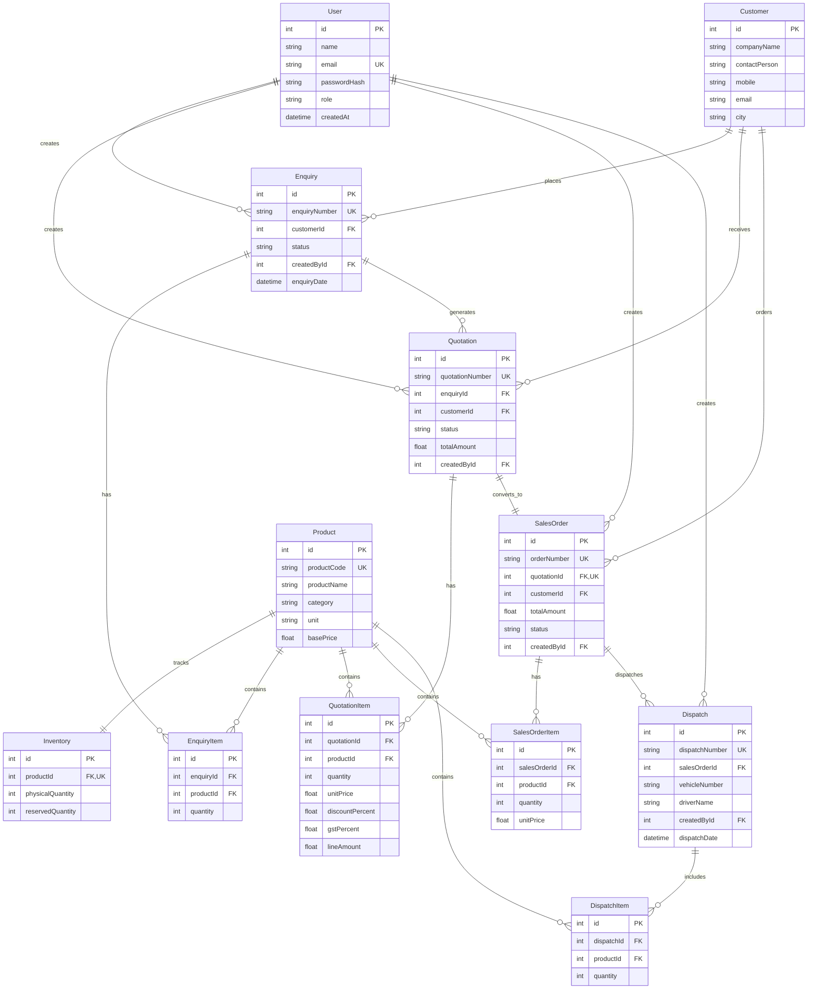

# UDYAM ERP — Entity-Relationship (ER) Diagram

```mermaid
erDiagram
    User ||--o{ Enquiry : creates
    User ||--o{ Quotation : creates
    User ||--o{ SalesOrder : creates
    User ||--o{ Dispatch : creates

    Customer ||--o{ Enquiry : places
    Customer ||--o{ Quotation : receives
    Customer ||--o{ SalesOrder : orders

    Product ||--|| Inventory : tracks
    Product ||--o{ EnquiryItem : contains
    Product ||--o{ QuotationItem : contains
    Product ||--o{ SalesOrderItem : contains
    Product ||--o{ DispatchItem : contains

    Enquiry ||--o{ EnquiryItem : has
    Enquiry ||--o{ Quotation : generates

    Quotation ||--o{ QuotationItem : has
    Quotation ||--|| SalesOrder : converts_to

    SalesOrder ||--o{ SalesOrderItem : has
    SalesOrder ||--o{ Dispatch : dispatches

    Dispatch ||--o{ DispatchItem : includes

    User {
        int id PK
        string name
        string email UK
        string passwordHash
        string role
        datetime createdAt
    }

    Customer {
        int id PK
        string companyName
        string contactPerson
        string mobile
        string email
        string city
    }

    Product {
        int id PK
        string productCode UK
        string productName
        string category
        string unit
        float basePrice
    }

    Inventory {
        int id PK
        int productId FK, UK
        int physicalQuantity
        int reservedQuantity
    }

    Enquiry {
        int id PK
        string enquiryNumber UK
        int customerId FK
        string status
        int createdById FK
        datetime enquiryDate
    }

    EnquiryItem {
        int id PK
        int enquiryId FK
        int productId FK
        int quantity
    }

    Quotation {
        int id PK
        string quotationNumber UK
        int enquiryId FK
        int customerId FK
        string status
        float totalAmount
        int createdById FK
    }

    QuotationItem {
        int id PK
        int quotationId FK
        int productId FK
        int quantity
        float unitPrice
        float discountPercent
        float gstPercent
        float lineAmount
    }

    SalesOrder {
        int id PK
        string orderNumber UK
        int quotationId FK, UK
        int customerId FK
        float totalAmount
        string status
        int createdById FK
    }

    SalesOrderItem {
        int id PK
        int salesOrderId FK
        int productId FK
        int quantity
        float unitPrice
    }

    Dispatch {
        int id PK
        string dispatchNumber UK
        int salesOrderId FK
        string vehicleNumber
        string driverName
        int createdById FK
        datetime dispatchDate
    }

    DispatchItem {
        int id PK
        int dispatchId FK
        int productId FK
        int quantity
    }
```
